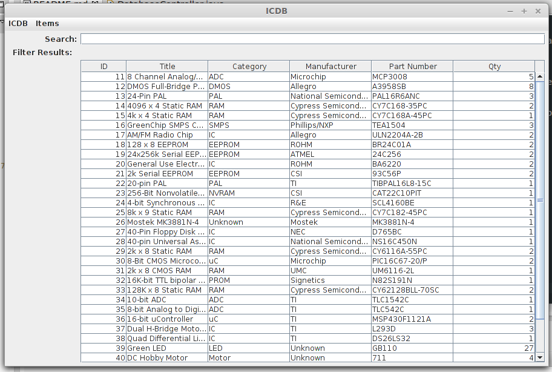
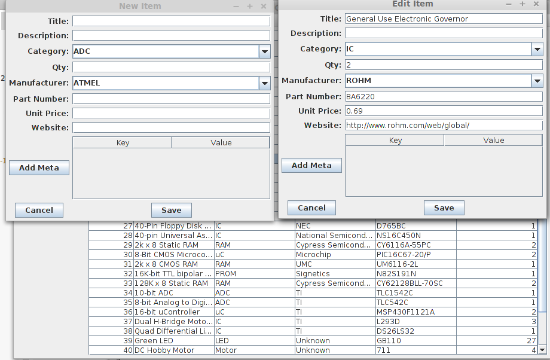
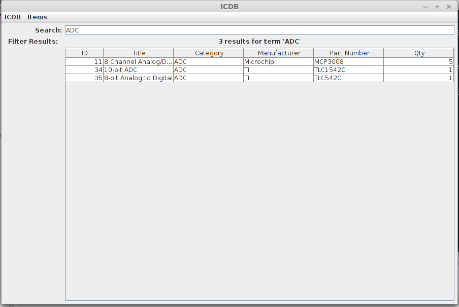

ICDB (IC Database)
==================

This project spawned from my need for a simple piece of software to index and keep up information about 
the ICs and various components in my possession. I wanted the end product to be simple to use and intuitive.
I also used this project to dive into Java development ([see here.](http://jacobncalvert.com/blog/post/diving-into-java))

There were a few basic features that I knew I had to have and I will detail those below

Features
--------------
* Add, Edit, Remove items from the DB
* Has standard item fields (like title, description, manufacturer, part id, unit price) plus a meta information table that can contain user defined key-value pairs
* Has export capabilities (currently to Text and CSV but soon to general SQL)
* Can be searched quickly on multiple criteria
* Had to be simple enough that quickly entering data was not a hassle

Due to points 1,2, and 4 I decided on a SQL backed system. 

Design
--------------
The app is backed by a SQLite3 database. This allows quick additions/updates/deletes via Java's OCDB driver.
The GUI is Swing based (this was my first Java GUI project as well.) 

Use
--------------
When you run the app, you are introduced to the main window. This window contains a searchable, sortable table of
all the items in your ICDB storage.

### Sorting the table in the main window
Click the header by which you wish to sort.

### Adding a new item
To add a new item, click Items->New Item (or alternatively ctrl-n) and the New Item Window will appear. Fill in those
values and click Save. The window will disappear and your new item will show up in the table.
NOTE: some fields like category and manufacturer will have default parameters in the New Item Window. These values
are retrieved base on your other items in the ICDB storage. 

### Searching for an item
Simple start typing your query into the search bar. It will filter the window as you type.

### Editing an item
Editing an item is simple. Search for the item you want to edit. Double click the entry, or right click and select 'Edit item'
The Edit Item Window will pop up and allow you to make the edits needed. Click save and you're done!

### Deleting an item
This is the simplest operation. Search for the item you want to edit. Right click the item and select 'Delete item'. Confirm the operation and that's it!

### Viewing an Item
Search for the item you want to view. Right click and select 'View Item'. The window will be read only so you cannot edit any info from here.

### Exporting
Navigate to ICDB->Export as...->[Your type]. Select a save location and click OK. It will be done!

### Viewing statistics
The app will calculate statistics about the items in your ICDB. Navigate to Items->Statistics and you'll be shown 
a small window with a summary of the item information in you storage. 

Future
----------
I plan more features as I think to add them. I hope to have an Import option to support several formats.

Screenshots
------------

